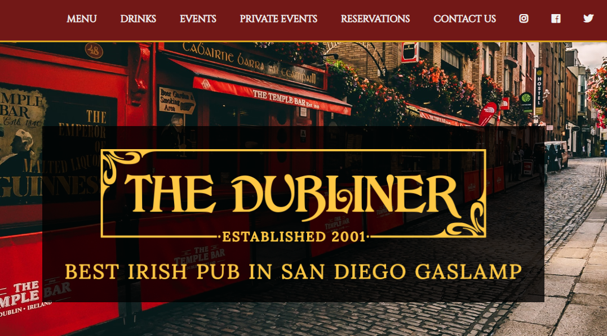

<h1>Sample 10 page website</h1>

<h2>DESCRIPTION</h2>

A sample 10+ page website featuring:

<h3>HTML</h3>
<ul>
<li>Reusable code with classes to customize code per page - ie heading element & menu/drink pages</li>
</ul>

<h3>JavaScript</h3>
<ul>
<li>A responsive navigation bar which becomes a hamburger menu with dropdown for mobile devices</li>
</ul>

<h3>CSS</h3>
<ul>
<li>Extensive use of media queries to optimize for mobile</li>
<li>Absolute and relative positioning for navigation element</li>
<li>Float and Clear properties utilized in food and drink menu</li>
<li>Google Fonts library</li>

</ul>

<h3>VIEW DEMO SITE:</h3>
<a href="https://elowskya.github.io/dubSite/index.html">https://elowskya.github.io/dubSite/index.html</a>